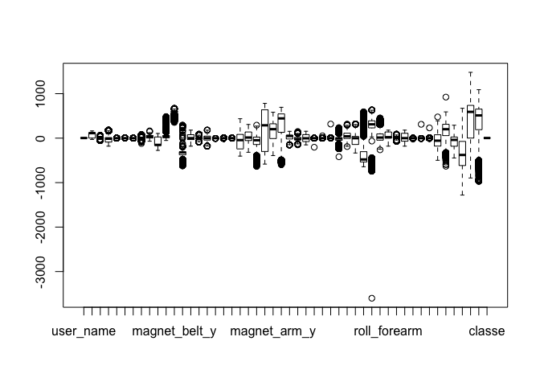

# ML - Weight Lifting Exercise
Idan Richman Goshen  
4/6/2017  


## Summary
Using the data from the accelerometers, we'll try to predict the manner in which the weight lifting exercise is done - covering 5 different methods.
first, we'll load our training and testing sets and then we'll look for a classifier to train our model, which gives us a good accuracy and prediction. 

## Background
Using devices such as Jawbone Up, Nike FuelBand, and Fitbit it is now possible to collect a large amount of data about personal activity relatively inexpensively. These type of devices are part of the quantified self movement – a group of enthusiasts who take measurements about themselves regularly to improve their health, to find patterns in their behavior, or because they are tech geeks. One thing that people regularly do is quantify how much of a particular activity they do, but they rarely quantify how well they do it. In this project, your goal will be to use data from accelerometers on the belt, forearm, arm, and dumbell of 6 participants. They were asked to perform barbell lifts correctly and incorrectly in 5 different ways. More information is available from the website here: <http://groupware.les.inf.puc-rio.br/har> (see the section on the Weight Lifting Exercise Dataset).

## Data preparation
I will load the .csv files with the data and select only the physical features from the accelerometers and eliminate variables such as time or stats. i decided to leave in the name variable because it makes sense that each person has its own unique data.

```r
training <- read.csv("pml-training.csv")
testing <- read.csv("pml-testing.csv")

#training<-select(training,-c(user_name,X,new_window,num_window,raw_timestamp_part_1,raw_timestamp_part_2,cvtd_timestamp))

features_col <- grep("^magnet|^gyros|^yaw|^roll|^pitch|^accel|^classe|^user",names(training))
new_train <- training[,features_col]
```

## Check missing values

```r
sum(is.na(new_train))
```

```
## [1] 0
```

There are no missing values!

## Getting some notion of the data

```r
str(new_train)
```

```
## 'data.frame':	19622 obs. of  50 variables:
##  $ user_name        : Factor w/ 6 levels "adelmo","carlitos",..: 2 2 2 2 2 2 2 2 2 2 ...
##  $ roll_belt        : num  1.41 1.41 1.42 1.48 1.48 1.45 1.42 1.42 1.43 1.45 ...
##  $ pitch_belt       : num  8.07 8.07 8.07 8.05 8.07 8.06 8.09 8.13 8.16 8.17 ...
##  $ yaw_belt         : num  -94.4 -94.4 -94.4 -94.4 -94.4 -94.4 -94.4 -94.4 -94.4 -94.4 ...
##  $ gyros_belt_x     : num  0 0.02 0 0.02 0.02 0.02 0.02 0.02 0.02 0.03 ...
##  $ gyros_belt_y     : num  0 0 0 0 0.02 0 0 0 0 0 ...
##  $ gyros_belt_z     : num  -0.02 -0.02 -0.02 -0.03 -0.02 -0.02 -0.02 -0.02 -0.02 0 ...
##  $ accel_belt_x     : int  -21 -22 -20 -22 -21 -21 -22 -22 -20 -21 ...
##  $ accel_belt_y     : int  4 4 5 3 2 4 3 4 2 4 ...
##  $ accel_belt_z     : int  22 22 23 21 24 21 21 21 24 22 ...
##  $ magnet_belt_x    : int  -3 -7 -2 -6 -6 0 -4 -2 1 -3 ...
##  $ magnet_belt_y    : int  599 608 600 604 600 603 599 603 602 609 ...
##  $ magnet_belt_z    : int  -313 -311 -305 -310 -302 -312 -311 -313 -312 -308 ...
##  $ roll_arm         : num  -128 -128 -128 -128 -128 -128 -128 -128 -128 -128 ...
##  $ pitch_arm        : num  22.5 22.5 22.5 22.1 22.1 22 21.9 21.8 21.7 21.6 ...
##  $ yaw_arm          : num  -161 -161 -161 -161 -161 -161 -161 -161 -161 -161 ...
##  $ gyros_arm_x      : num  0 0.02 0.02 0.02 0 0.02 0 0.02 0.02 0.02 ...
##  $ gyros_arm_y      : num  0 -0.02 -0.02 -0.03 -0.03 -0.03 -0.03 -0.02 -0.03 -0.03 ...
##  $ gyros_arm_z      : num  -0.02 -0.02 -0.02 0.02 0 0 0 0 -0.02 -0.02 ...
##  $ accel_arm_x      : int  -288 -290 -289 -289 -289 -289 -289 -289 -288 -288 ...
##  $ accel_arm_y      : int  109 110 110 111 111 111 111 111 109 110 ...
##  $ accel_arm_z      : int  -123 -125 -126 -123 -123 -122 -125 -124 -122 -124 ...
##  $ magnet_arm_x     : int  -368 -369 -368 -372 -374 -369 -373 -372 -369 -376 ...
##  $ magnet_arm_y     : int  337 337 344 344 337 342 336 338 341 334 ...
##  $ magnet_arm_z     : int  516 513 513 512 506 513 509 510 518 516 ...
##  $ roll_dumbbell    : num  13.1 13.1 12.9 13.4 13.4 ...
##  $ pitch_dumbbell   : num  -70.5 -70.6 -70.3 -70.4 -70.4 ...
##  $ yaw_dumbbell     : num  -84.9 -84.7 -85.1 -84.9 -84.9 ...
##  $ gyros_dumbbell_x : num  0 0 0 0 0 0 0 0 0 0 ...
##  $ gyros_dumbbell_y : num  -0.02 -0.02 -0.02 -0.02 -0.02 -0.02 -0.02 -0.02 -0.02 -0.02 ...
##  $ gyros_dumbbell_z : num  0 0 0 -0.02 0 0 0 0 0 0 ...
##  $ accel_dumbbell_x : int  -234 -233 -232 -232 -233 -234 -232 -234 -232 -235 ...
##  $ accel_dumbbell_y : int  47 47 46 48 48 48 47 46 47 48 ...
##  $ accel_dumbbell_z : int  -271 -269 -270 -269 -270 -269 -270 -272 -269 -270 ...
##  $ magnet_dumbbell_x: int  -559 -555 -561 -552 -554 -558 -551 -555 -549 -558 ...
##  $ magnet_dumbbell_y: int  293 296 298 303 292 294 295 300 292 291 ...
##  $ magnet_dumbbell_z: num  -65 -64 -63 -60 -68 -66 -70 -74 -65 -69 ...
##  $ roll_forearm     : num  28.4 28.3 28.3 28.1 28 27.9 27.9 27.8 27.7 27.7 ...
##  $ pitch_forearm    : num  -63.9 -63.9 -63.9 -63.9 -63.9 -63.9 -63.9 -63.8 -63.8 -63.8 ...
##  $ yaw_forearm      : num  -153 -153 -152 -152 -152 -152 -152 -152 -152 -152 ...
##  $ gyros_forearm_x  : num  0.03 0.02 0.03 0.02 0.02 0.02 0.02 0.02 0.03 0.02 ...
##  $ gyros_forearm_y  : num  0 0 -0.02 -0.02 0 -0.02 0 -0.02 0 0 ...
##  $ gyros_forearm_z  : num  -0.02 -0.02 0 0 -0.02 -0.03 -0.02 0 -0.02 -0.02 ...
##  $ accel_forearm_x  : int  192 192 196 189 189 193 195 193 193 190 ...
##  $ accel_forearm_y  : int  203 203 204 206 206 203 205 205 204 205 ...
##  $ accel_forearm_z  : int  -215 -216 -213 -214 -214 -215 -215 -213 -214 -215 ...
##  $ magnet_forearm_x : int  -17 -18 -18 -16 -17 -9 -18 -9 -16 -22 ...
##  $ magnet_forearm_y : num  654 661 658 658 655 660 659 660 653 656 ...
##  $ magnet_forearm_z : num  476 473 469 469 473 478 470 474 476 473 ...
##  $ classe           : Factor w/ 5 levels "A","B","C","D",..: 1 1 1 1 1 1 1 1 1 1 ...
```

```r
boxplot(new_train)
```

<!-- -->

In the boxplot we can spot an outlier. Even if measured correctly (and not a false measure) this outlier can cause some bias, and i think it it better to exclude it.


```r
 new_train <- new_train[-which(new_train$magnet_dumbbell_y < -3000),]
```

## Training the model

Now i will train the model using 3 classifiers - first with decision tree, second with linear discriminant analysis, as it is a simple and effective method for classification. Third, i used regularized discriminant analysis to mitigate high impacting predictors causing over-fitting. I also wanted to train using random forset, but it took too much computation time and left me hanging.
I will use cross-validation technique of k-folds with 10 folds, repeated 3 times, to avoid over-fitting and to improve accuracy.


```r
model <- train(classe~.,data=new_train,method="rpart",metric="Accuracy",trControl=trainControl(method="repeatedcv", number=10, repeats=3))
```

```
## Loading required package: rpart
```

```r
model2 <- train(classe~.,data=new_train,method="lda",metric="Accuracy",trControl=trainControl(method="repeatedcv", number=10, repeats=3))
```

```
## Loading required package: MASS
```

```
## 
## Attaching package: 'MASS'
```

```
## The following object is masked from 'package:dplyr':
## 
##     select
```

```r
model3 <- train(classe~.,data=new_train,method="rda")
```

```
## Loading required package: klaR
```

```r
model$results
```

```
##           cp  Accuracy     Kappa AccuracySD    KappaSD
## 1 0.03568122 0.5062803 0.3551813 0.01393843 0.01883436
## 2 0.05999098 0.4241234 0.2222537 0.06300895 0.10626634
## 3 0.11516274 0.3211388 0.0559772 0.04002970 0.06093471
```

```r
model2$results
```

```
##   parameter  Accuracy     Kappa  AccuracySD    KappaSD
## 1      none 0.7333967 0.6620727 0.009940408 0.01262064
```

```r
model3$results
```

```
##   gamma lambda  Accuracy     Kappa  AccuracySD     KappaSD
## 1   0.0    0.0 0.9065173 0.8818379 0.003088642 0.003878088
## 2   0.0    0.5 0.8431427 0.8023922 0.008046998 0.009877444
## 3   0.0    1.0 0.7323150 0.6606489 0.005790449 0.007298111
## 4   0.5    0.0 0.5121825 0.3898797 0.010058241 0.011140504
## 5   0.5    0.5 0.5238820 0.4018545 0.006669581 0.007608511
## 6   0.5    1.0 0.4944887 0.3554819 0.003314358 0.004008810
## 7   1.0    0.0 0.3943030 0.2305110 0.006063321 0.007326319
## 8   1.0    0.5 0.3991224 0.2361931 0.005662426 0.006728430
## 9   1.0    1.0 0.4055563 0.2436072 0.005933536 0.006951252
```

as can see, the RDA classifier performed much better than the others.
Thus, i will use it to predict on the test set.


```r
pred <- predict(model3,newdata=testing)
```

```
## Loading required package: klaR
```

```
## Loading required package: MASS
```

```
## 
## Attaching package: 'MASS'
```

```
## The following object is masked from 'package:dplyr':
## 
##     select
```

```r
pred
```

```
##  [1] A A B A A E D B A A B C B A E E A B B B
## Levels: A B C D E
```

I believe the out of sample error is somewhat higher than the error i got from my training set, mainly because our model is optimized to the training and CV sets, and not for data the model has never seen. This will cause lower accuracy on the test set.
